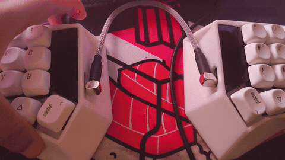

# Corne v3 (RP2040) — QMK keymap

**QMK firmware for a Corne (crkbd) v3 split keyboard driven by an RP2040
microcontroller.** Building this repo produces a `.uf2` flash file that you load
onto the board's RP2040 (via the `RPI-RP2` bootloader drive). It's a custom
keymap featuring OLED animations (boot octopus, per-half last-key readout) and a
per-key RGB matrix. Structured as a **QMK External Userspace** repo, so it builds
without modifying your `qmk_firmware` clone.

## Demo




## What's here

```
qmk.json                              # external-userspace build target
keyboards/crkbd/keymaps/corne/
    keymap.c                          # layers, OLED rendering, encoder map
    config.h                          # RGB matrix + OLED options
    rules.mk                          # feature toggles (OLED, RGB matrix)
```

## Compile & flash

Requires a working QMK CLI + toolchain (`qmk setup` done once). From the repo
root:

```powershell
qmk config user.overlay_dir="$(Get-Location)"   # point QMK at this repo (one-time)
qmk userspace-compile                            # build the .uf2
qmk flash -kb crkbd/rev1 -km corne               # build + flash
```

To flash manually: double-tap the reset button (the board mounts as the
`RPI-RP2` drive) and copy the generated `.uf2` onto it.

## Board target

This is a classic Corne (**`crkbd/rev1`**) PCB with an RP2040 "Pro Micro"
controller. The converter is set in `keymaps/corne/rules.mk`:

```make
CONVERT_TO = rp2040_ce
```

If keys don't register after flashing, the controller may use a different
converter — try `promicro_rp2040` (or `elite_pi` / `sea_picro`) instead.

## Keymap

Four layers on a 42-key split. Hold **MO(1)** (left inner thumb) for NUMS, **MO(2)**
(right inner thumb) for SYMB, and **MO(3)** (reachable from either NUMS or SYMB) for FUNC.

Keys with two symbols show `base shifted` (e.g. `/ ?` types `/`, or `?` with Shift).

### Layer 0 — BASE
```
┌─────┬─────┬─────┬─────┬─────┬─────┐   ┌─────┬─────┬─────┬─────┬─────┬─────┐
│ TAB │  Q  │  W  │  E  │  R  │  T  │   │  Y  │  U  │  I  │  O  │  P  │ BSPC│
├─────┼─────┼─────┼─────┼─────┼─────┤   ├─────┼─────┼─────┼─────┼─────┼─────┤
│ LSFT│  A  │  S  │  D  │  F  │  G  │   │  H  │  J  │  K  │  L  │ ; : │ ' " │
├─────┼─────┼─────┼─────┼─────┼─────┤   ├─────┼─────┼─────┼─────┼─────┼─────┤
│ LCTL│  Z  │  X  │  C  │  V  │  B  │   │  N  │  M  │ , < │ . > │ / ? │ ESC │
└─────┴─────┴─────┴─────┴─────┴─────┘   └─────┴─────┴─────┴─────┴─────┴─────┘
                  ┌─────┬─────┬─────┐   ┌─────┬─────┬─────┐
                  │ LGUI│MO(1)│ SPC │   │ ENT │MO(2)│ RALT│
                  └─────┴─────┴─────┘   └─────┴─────┴─────┘
```

### Layer 1 — NUMS (hold left thumb)
```
┌─────┬─────┬─────┬─────┬─────┬─────┐   ┌─────┬─────┬─────┬─────┬─────┬─────┐
│ ESC │  1  │  2  │  3  │  4  │  5  │   │  6  │  7  │  8  │  9  │  0  │ DEL │
├─────┼─────┼─────┼─────┼─────┼─────┤   ├─────┼─────┼─────┼─────┼─────┼─────┤
│ LSFT│  ·  │  ·  │  ·  │  ·  │  ·  │   │  ←  │  ↓  │  ↑  │  →  │ PGUP│ HOME│
├─────┼─────┼─────┼─────┼─────┼─────┤   ├─────┼─────┼─────┼─────┼─────┼─────┤
│ LCTL│  ·  │  ·  │  ·  │  ·  │  ·  │   │  ·  │  ·  │  ·  │  ·  │ PGDN│ END │
└─────┴─────┴─────┴─────┴─────┴─────┘   └─────┴─────┴─────┴─────┴─────┴─────┘
                  ┌─────┬─────┬─────┐   ┌─────┬─────┬─────┐
                  │ LGUI│  ▽  │ SPC │   │ ENT │MO(3)│ RALT│
                  └─────┴─────┴─────┘   └─────┴─────┴─────┘
```

### Layer 2 — SYMB (hold right thumb)
```
┌─────┬─────┬─────┬─────┬─────┬─────┐   ┌─────┬─────┬─────┬─────┬─────┬─────┐
│ ESC │  !  │  @  │  #  │  $  │  %  │   │  ^  │  &  │  *  │  (  │  )  │ DEL │
├─────┼─────┼─────┼─────┼─────┼─────┤   ├─────┼─────┼─────┼─────┼─────┼─────┤
│ LSFT│  ·  │  ·  │  ·  │  ·  │  ·  │   │  -  │  =  │  [  │  ]  │  \  │  `  │
├─────┼─────┼─────┼─────┼─────┼─────┤   ├─────┼─────┼─────┼─────┼─────┼─────┤
│ LCTL│  ·  │  ·  │  ·  │  ·  │  ·  │   │  _  │  +  │  {  │  }  │  |  │  ~  │
└─────┴─────┴─────┴─────┴─────┴─────┘   └─────┴─────┴─────┴─────┴─────┴─────┘
                  ┌─────┬─────┬─────┐   ┌─────┬─────┬─────┐
                  │ LGUI│MO(3)│ SPC │   │ ENT │  ▽  │ RALT│
                  └─────┴─────┴─────┘   └─────┴─────┴─────┘
```

### Layer 3 — FUNC (hold MO(3): both thumbs)
```
┌─────┬─────┬─────┬─────┬─────┬─────┐   ┌─────┬─────┬─────┬─────┬─────┬─────┐
│  F1 │  F2 │  F3 │  F4 │  F5 │  F6 │   │  F7 │  F8 │  F9 │ F10 │ F11 │ F12 │
├─────┼─────┼─────┼─────┼─────┼─────┤   ├─────┼─────┼─────┼─────┼─────┼─────┤
│ TOG │ HUE+│ SAT+│ VAL+│ UGLO│  ·  │   │  ·  │  ·  │  ·  │ TOG │ NEXT│ RCT │
├─────┼─────┼─────┼─────┼─────┼─────┤   ├─────┼─────┼─────┼─────┼─────┼─────┤
│ NEXT│ HUE-│ SAT-│ VAL-│  ·  │ BOOT│   │  ·  │  ·  │  ·  │  ·  │  ·  │  ·  │
└─────┴─────┴─────┴─────┴─────┴─────┘   └─────┴─────┴─────┴─────┴─────┴─────┘
                  ┌─────┬─────┬─────┐   ┌─────┬─────┬─────┐
                  │ LGUI│  ▽  │ SPC │   │ ENT │  ▽  │ RALT│
                  └─────┴─────┴─────┘   └─────┴─────┴─────┘
```

**Legend:** ▽ = transparent (same key as the layer below) · · = unused ·
arrows ←↓↑→ = KC_LEFT/DOWN/UP/RIGHT · nav cluster **PGUP/PGDN/HOME/END** and **DEL** live on NUMS.
RGB keys — **TOG** toggle, **HUE± / SAT± / VAL±** colour/brightness, **NEXT** next effect,
**RCT** cycle reactive/splash effects, **UGLO** underglow-only, **BOOT** bootloader (flash mode).
